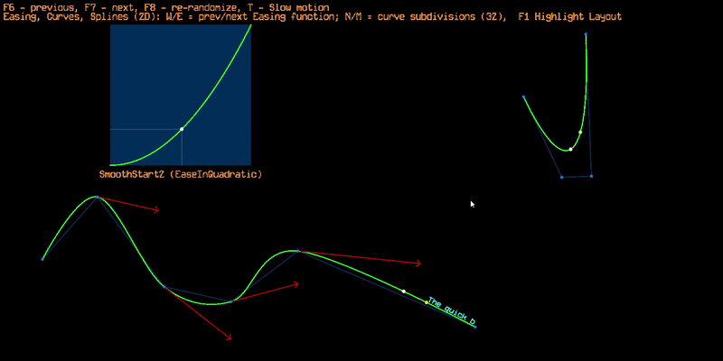

# MathVisualTests

## Features
- Get Nearest Point from Disc, Triangle2, AABB2, OBB2, Capsule2, LineSegment2, Sphere, AABB3, ZCylinder, OBB3, Plane3
- Raycast to Disc, Triangle2, AABB2, Capsule2, LineSegment2, Sphere, AABB3, ZCylinder, OBB3, Plane3
- Is Point Inside Disc, Triangle2, AABB2, Capsule2, Sphere, AABB3, ZCylinder, OBB3
- Fast Voxel Raycast
- Spline 2D/3D and Easing Function
- Quaternion
- 2D Physics Simulation

## Gallery
> Geometry Tests  
> 

> Spline 2D/3D and Quaternion  
> 

> 2D Physics  
> 

## Controls
```
F6 - previous, 
F7 - next, 
F8 - re-randomize, 
T - Slow motion
```

## How to run
Go to `PROJECT_NAME/Run/` and Run `PROJECT_NAME_Release_x64.exe`

## How to build
1. Clone Project
```bash
git clone --recurse-submodules https://github.com/cloud-sail/ChessDX.git
```
2. Open Solution `PROJECT_NAME.sln` file
- In Project Property Pages
  - Debugging->Command: `$(TargetFileName)`
  - Debugging->Working Directory: `$(SolutionDir)Run/`
